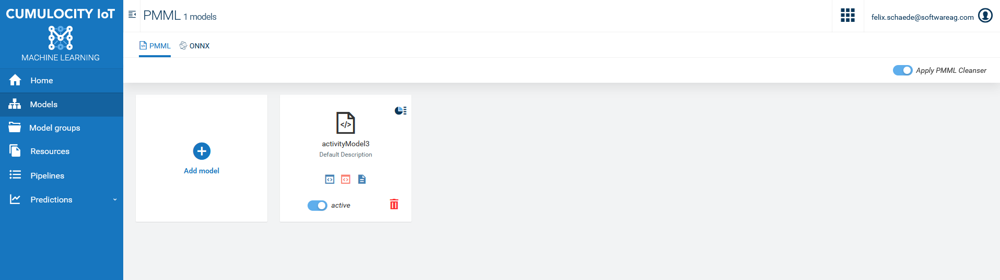

# Cumulocity phone activity recognition
Simple example of how machine learning models can be run in cumulocity. For a more detailed description, take a look at the [Cumulocity Guide](https://cumulocity.com/guides/machine-learning/activity-recognition/).

Cumulocity is an IoT platform that enables rapid connections of many, many different devices and applications. It allows you to monitor and respond to IoT data in real time and to spin up this capability in minutes. More information on Cumulocity IoT and how to start a free trial can be found [here](https://www.softwareag.cloud/site/product/cumulocity-iot.html#/).

Cumulocity IoT enables companies to quickly and easily implement smart IoT solutions.

______________________

For more information you can Ask a Question in the [TECHcommunity Forums](http://tech.forums.softwareag.com/techjforum/forums/list.page?product=webmethods-io-b2b).

You can find additional information in the [Software AG TECHcommunity](http://techcommunity.softwareag.com/home/-/product/name/webmethods-io-b2b).

______________________

These tools are provided as-is and without warranty or support. They do not constitute part of the Software AG product suite. Users are free to use, fork and modify them, subject to the license agreement. While Software AG welcomes contributions, we cannot guarantee to include every contribution in the master project.

Contact us at [TECHcommunity](mailto:technologycommunity@softwareag.com?subject=Github/SoftwareAG) if you have any questions.

## Prerequisite
Cumulocity tenant with subscription to:
    - [x] Machine Learning
    - [x] Streaming analytics
    - [x] For training Machine Learning Workbench

## Running the model

1. Download the cumulocity sensor app to your phone and connect your phone to your tenant. Set the sensor app to send a measurement value for the acceleration and the gyroscope every second.

Acceleration             |  Gyroscope
:-------------------------:|:-------------------------:
  |  

2. To run the model in cumulocity open the application machine learining in cumulocity and upload the .pmml model.

Make sure, that the model is activated after upload.

3. Open EPL apps in Streaming analytics and copy the monitor file (*.mon) to an new EPL app. Activate the monitor to start running the ML-Model. An alarm is generated for each new movement as soon as the same movement is detected 3 times in a row. Probabilities for the individual movements are sent to the platform as measurements.
